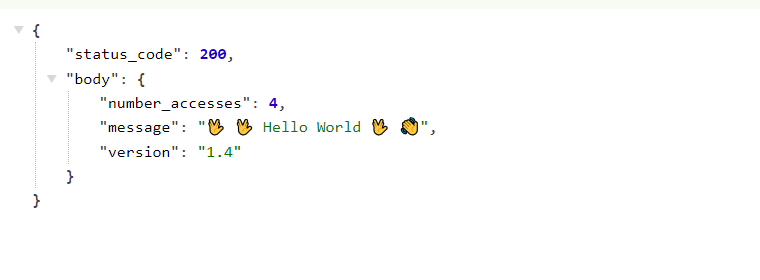

# AWS CICD with GitHub Actions and AWS CDK.

This is a basic guide to configuring CI/CD with Github Actions and AWS CDK (Cloud Development Kit).
It is hosted on serverless AWS infrastructure (using Lambda and DynamoDB).




## .Github/workflows

The `/.github/workflows` folder contains code about workflow and preferences.

## Lambda Folder

The `/lambda` folder contains the Python code.

## Infrastructure Folder

You must have [AWS CLI](https://aws.amazon.com/cli/) configured, and
[AWS CDK](https://docs.aws.amazon.com/cdk/v2/guide/home.html) installed on your machine.

First, install the node modules.

```bash
npm install
```

Then run bootstrap if you never used CDK with your account before.

```bash
cdk bootstrap
```

Copy the pre-commit file into the hooks folder with the name pre-commit.

```bash
cp pre-commit .git/hooks/pre-commit
```
